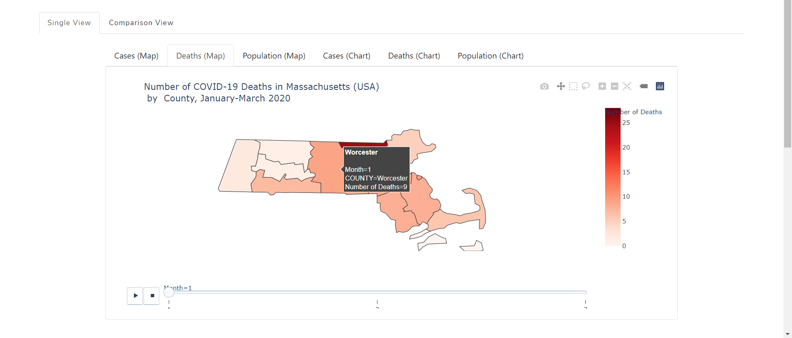

[](https://travis-ci.org/co-map-v/co-map-v.github.io)
[](https://coveralls.io/github/co-map-v/co-map-v.github.io?branch=main)


# CO-MAP-V: COVID-19 Massachusetts Map + Visualization Tool

CO-MAP-V is a Python-based dynamic visualization tool built on [Plotly] and [Dash], and implemented through [Heroku]. It generates an easy-to-use comparative clickable interface depicting county-level Synthea data in the OMOP common data model to vizualize an outbreak of COVID-19 in Massachusetts for the time period January-March 2020. It provides simple options for time-series comparisons with month-specific interactive timesliders. 
###### Access CO-MAP-V at: [co-map-v.github.io](https://co-map-v.github.io)


##### Included in the dashboard:
- Maps and complementary histograms of month-specific data pertaining to:
    -  Number of deaths per county; 
    -  Number of positive case counts per county; 
    -  Population density per county (based on 2010 US Census estimates).

Below is the screenshot for comparison view dashboard. Note that users can hover their mouse on different counties to see details as shown in the screenshot.
<br/>
<br/>

<br/>
<br/>
Below is another screenshot for single view dashboard:
<br/>
<br/>

<br/>
<br/>

#### Background
Current COVID-19 research focuses on increasing our understanding of how the virus spreads through communities and neighborhoods. Given the novelty of the virus, researchers face many challenges and unknowns. First, obtaining access to patient data can be a limiting factor, especially as patient data is protected and governed by the Health Insurance Portability and Accountability Act (HIPAA). Second, understanding the trends of the data may be difficult as data representation and visualization methods are highly variable, making the data subject to interpretability. Synthetic data -- simulated data that are generated based on the trends and patterns of real data -- may provide an avenue for researchers to better understand real-world data trends without the need to overcome the obstacles involved in obtaining real patient data. Since synthetic data may be modeled on real-world data, it may allow researchers to generate results that are meaningful and translatable while being more accessible.

#### Goals:
- With the synthetic COVID-19 data, we aim to build a visualization dashboard that features a choropleth map as well as a complementary chart.
- With the dashboard, we aim to allow users (both those experienced and inexperienced with public health methods) to explore the trends and geographic spread of COVID-19 in Massachusetts.
- Seek to create an open exploratory visualization tool framework that allows users who have basic Python, GeoJSON and data cleaning knowledge to make visualizations from their own COVID-19 demographic data in the Observational Medical Outcomes Partnership (OMOP) common data format, and include an appropriate GeoJSON, with minimal effort. 

#### Directory Structure
```
co-map-v.github.io/
├── comapv/
│   ├── app.py
│   ├── __init__.py
│   ├── data/
│   │   ├── Old/
|   |   |   ├── ...
│   │   ├── __init__.py
│   │   ├── covid_ma_positive_death_counts.csv
│   │   ├── data-1605136079581.csv
│   │   ├── data_backup/
|   |   |   ├── ...
│   │   ├── data_clean.py
│   │   ├── data_cleaning.py
│   │   ├── ma_map.geojson
│   │   └── population2010.csv
│   └── tests/
│       ├── __init__.py
│       ├── smoketest_data.csv
│       ├── tests.py
│       └── tests_viz.py
├── docs/
│   ├── Component Specification.pdf
|   ├── Final presentation.pdf
│   ├── Functional Specification.pdf
│   ├── Technology review presentation.pdf
│   ├── index.html
│   └── website/
|   |   ├── ...
├── .travis.yml
├── LICENSE
├── Procfile
├── README.md
├── environment.yml
├── requirements.txt
└── setup.py
```

#### Data

Our dataset is a synthetic COVID-19 created by Synthea that was later converted into the OMOP common data model. The data can be found at the [OHDSI] site. 

The data spans a period of three months, January 2020 to March 2020, mimicking the start of the pandemic and contains approximately 10,000 unique patients. The OMOP model is used and thus we have the following data tables at our disposal: `cdm_source`, `condition_era`, `condition_occurrence`, `death`, `drug_era`, `drug_exposure`, `location`, `measurement`, `observation_period`, `observation`, `person`, `procedure_occurrence`, `visit_occurrence`. 

Each of the data tables have their own keys, but can be joined by `person_id`. All of the available data tables are not utilized in this project since many are irrelevant to our use cases. Our analysis will be within the `condition_occurrence`, `death`, `location`, and `person` tables. Within the `person` table, we will be able to obtain the `gender`, `race`, `ethnicity`, and `death date` (if applicable). The `location table` contains the physical address of the patient. Although there is a ZIP code field within the location table, we have estimated that ~50% of the column is not available; therefore, we will be utilizing the `county` field instead. COVID-19 information is stored in the `condition` table. Using the Athena vocabulary standard, we have determined that a `condition_concept_id` of '37311061' indicates ‘Disease caused by 2019-nCoV’ (the virological name of the virus that causes COVID-19). Additionally, we incorporate the latest [United States 2010 Census data] for Massachusetts. 

To fully geographically visualize the data, we use GeoJSON file of Massachusetts representing county boundaries. Ideally, geographic-demographic data table joining is completed based on Federal Information Processing Standard (FIPS) code. However, our synthetic dataset does not include FIPS codes, and so we have opted to perform spatial joins by simple county name (i.e. “Hampshire”, not “Hampshire County”). The particular GeoJSON file we are using is found at the [TopoJSON Github Repository] of topographic GeoJSON files for open use. 

#### More information can be found in the [Functional] and [Component] Specifications (PDF links).

# Technical Information

### Installation and set up

First, make sure that you have Python via Anaconda installed, [https://conda.pydata.org/miniconda.html](https://conda.pydata.org/miniconda.html). 

Use the YML environment file to create an identical environment on your local or remote machine:
    
    conda create --name myenv —environment.yml

For reference: [This is our YML for our conda virtual environment]; and [this is the requirements.txt file].


# Tips for Modifying CO-MAP-V Code for Personal Use
First, clone our repository.
    
    git clone https://github.com/co-map-v/co-map-v.github.io

Then make the following changes as needed

## Data

### GeoJson Data
* Get the needed .json files from https://github.com/deldersveld/topojson/tree/master/countries/us-states
* Append them together into one file called 'ma_map.geojson' to avoid renaming the file in scripts.
* Delete and replace this repository's 'ma_map.geojson' file with your own geojson file formatted the same way (e.g. same columns and data types)

### Population Data
* Get the needed census data of population by county from https://data.census.gov
* Name the file 'population2010.csv', replace our ~/comapv/data/population2010.csv with your own file and ensure it is formatted the same way (e.g. same columns and data types)
### Patient Data
* If using data formatted in the OMOP CDM (v5.3.1), refer to the first few commented lines of ~/comapv/data/data_cleaning.py which includes the SQL script used for data extraction from the synthea data formatted in the OMOP CDM:

   ```SQL
   SELECT DISTINCT l.zip, l.county, p.person_id, p.gender_source_value,
   p.birth_datetime, p.death_datetime, p.race_source_value,
   p.ethnicity_source_value, c.condition_start_datetime,
   c.condition_concept_id
   FROM person p
   INNER JOIN condition_occurrence c ON c.person_id = p.person_id
   INNER JOIN location l on l.location_id = p.location_id
   WHERE condition_concept_id = '37311061' --Disease caused by 2019-nCoV
   ```

* If not using data formatted in the OMOP CDM, make sure to query your data with the result formatted the same (e.g. same columns and data types) as the data are in ~/comapv/data/data-1605136079581.csv and name your file 'data-1605136079581.csv' for ease of use to ensure you won't have to rename the file when it is referenced in analysis and/or testing.

### Cleaning your data:
1. Make sure your data ('data-1605136079581.csv' and 'population2010.csv') are formatted the same as they are in this repository.
2. Edit ~/comapv/data/data_clean.py to change the name of the output file (currently 'covid_ma_positive_death_counts.csv') to a name suitable for your project 
3. Run ~/comapv/data/data_clean.py
4. Adjust tests as needed if name of output file ('covid_ma_positive_death_counts.csv') has changed.

## Web deployment
* Refer to the documentation seen here regarding heroku and dash: 
   * https://dash.plotly.com/deployment 
   * https://devcenter.heroku.com/articles/github-integration


[//]: # (Reference Links)

   [Plotly]: <https://www.plotly.com/>
   [Dash]: <https://dash.plotly.com/>
   [OHDSI]: <https://forums.ohdsi.org/t/synthetic-data-with-simulated-covid-outbreak/10256>
   [TopoJSON Github Repository]: <https://www.github.com/deldersveld/topojson/tree/master/countries/us-states>
   [Heroku]: <https://www.heroku.com>
   [Functional]: <https://github.com/co-map-v/co-map-v.github.io/blob/main/docs/Functional%20Specification.pdf>
   [Component]: <https://github.com/co-map-v/co-map-v.github.io/blob/main/docs/Component%20Specification.pdf>
   [This is our YML for our conda virtual environment]: <https://github.com/co-map-v/co-map-v.github.io/blob/main/environment.yml>
   [this is the requirements.txt file]: <https://github.com/co-map-v/co-map-v.github.io/blob/main/requirements.txt>   
